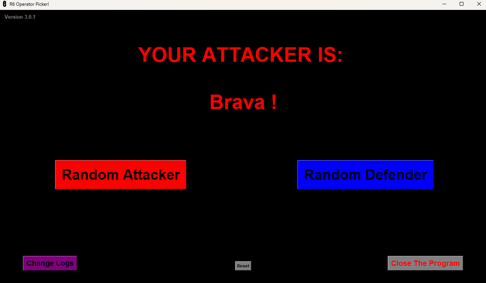

# | R6 Operator Picker!
'R6 Operator Picker', as described
in the GitHub description,
is a small program written in
python which aims to grant
the user the ability to
choose a random operator in
[**Tom Clancy's Rainbow Six: Siege**](https://www.ubisoft.com/en-us/game/rainbow-six/siege)!

> # | Previews!
> ## | Default Screen:
>> 
>
> ## | Chosen Attacker:
>> 
> 
> ## | Chosen Defender:
>> 

## | Legacy Versions:
Legacy versions of this program
utilizing only a Terminal based
UI can be found [**Here**](legacy)!

However, please keep in mind
that **these versions are outdated
and are not maintained**! They
are only included as a
means of providing a project
history before my initial GitHub
commit!

The original changelogs written for
these versions can be found
and read inside versions 3.0
and above, via the 'Change
Logs' button! ( *Future updates will
appear here as well!* )

> ### | Legacy Files Include:
> - [1.0](legacy/v1.0) - This is the **First Version** of R6 Operator Picker!
> - [1.0.1](legacy/v1.0.1) - This version includes a couple very minor changes.
> - [2.0](legacy/v2.0) - In this version, the script was completely rewritten and slightly improved upon.

# | Final Notes:
- I plan to make a
patch every season release of
[**Tom Clancy's Rainbow Six: Siege**](https://www.ubisoft.com/en-us/game/rainbow-six/siege),
to keep the list of
possible operators up to date
with current versions! As well
as making other improvements if
possible, or if necessary!
- The 'reset' button, as shown
in the preview photos, is
mostly a debug button. This
does nothing but reset the
state of the chosen operator
text back to default, and
is not relied upon for
the program's functionality!